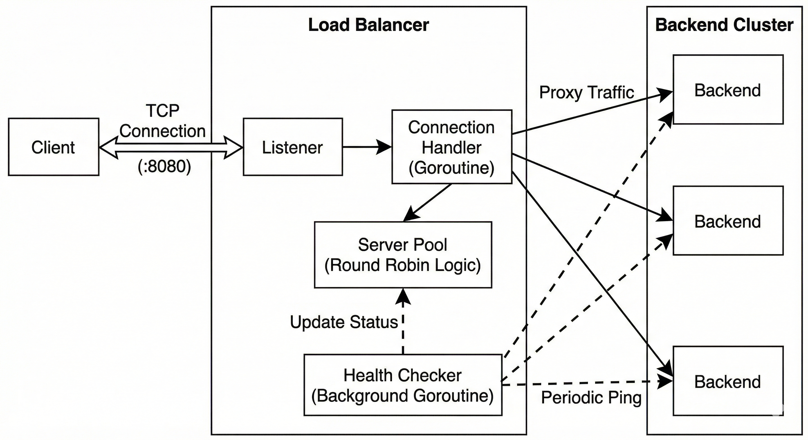

# Go-LoadBalancer


A high-concurrency **Layer 4 (TCP) Load Balancer** built from scratch in Go.

This project demonstrates core system programming concepts including **Goroutines**, **Channels**, **Atomic Operations**, and **Mutex-based state management**. It effectively distributes incoming TCP traffic across a pool of backend servers using a Round-Robin algorithm with active health monitoring.

---

## Features

* **Layer 4 Balancing:** Agnostic to the application protocol (works with HTTP, GRPC, raw TCP).
* **Weighted Round Robin:** thread-safe server selection using `atomic` counters.
* **Active Health Checks:** Background worker ("The Doctor") periodically pings backends and removes dead servers from rotation automatically.
* **Concurrency:** Handles thousands of concurrent connections using lightweight Goroutines.
* **Thread Safety:** Uses `sync.RWMutex` to prevent race conditions during state updates (Health Checks vs. Request Handling).
* **Clean Architecture:** Separation of concerns between Network Logic (`cmd`) and Business Logic (`core`).

---

## Architecture

The system consists of a main Load Balancer listener and a dynamic Server Pool.




## Project Structure
```
go-loadbalancer/
├── cmd/
│   ├── lb/
│   │   └── main.go       # Entry point: Listener & connection handler
│   └── backend/
│       └── main.go       # Utility: Dummy backend server for testing
├── core/
│   ├── server.go        # Struct: Defines Server state (Alive/Dead, URL, Mutex)
│   └── server_pool.go    # Logic: Round Robin algo & Health Check worker
├── go.mod                # Module definitions
└── README.md
```

## Running the Project

Prerequisites
- Go 1.21+ installed.

### 1. Start the Dummy Servers
Open 3 separate terminal tabs/windows to simulate a cluster of servers.
```Bash
# Terminal 1
go run ./cmd/backend 8000

# Terminal 2
go run ./cmd/backend 8001

# Terminal 3
go run ./cmd/backend 8002
```
### 3. Start the Load Balancer
Open a 4th terminal.
```Bash
go run ./cmd/lb
# Output: Load Balancer started on :8080
# Output: Starting health check...
```

### 4. Test the Traffic Distribution
Open a 5th terminal and curl the load balancer. Run this multiple times.

```Bash
curl localhost:8080
```

### Expected Output

```
Hello from Backend Server on port: 8000
Hello from Backend Server on port: 8001
Hello from Backend Server on port: 8002
Hello from Backend Server on port: 8000
```

### 5. Test Fault Tolerance (Health Checks)
1. Kill the backend running on port 8001 (Ctrl+C).
2. Wait 10 seconds (check LB logs for Server localhost:8001 is DOWN).
3. Run `curl localhost:8080` again.

**Result:** You will only see responses from ports 8000 and 8002. The LB automatically skips the dead server.

## Future Improvements
[ ] Weighted Round Robin: Assign capacity weights to stronger servers.

[ ] Least Connections Algorithm: Route traffic to the server with fewest active connections.

[ ] Configuration File: Read ports and hosts from a config.yaml instead of hardcoding.

[ ] Retries: If a backend fails during a request, retry the next available peer instantly.
